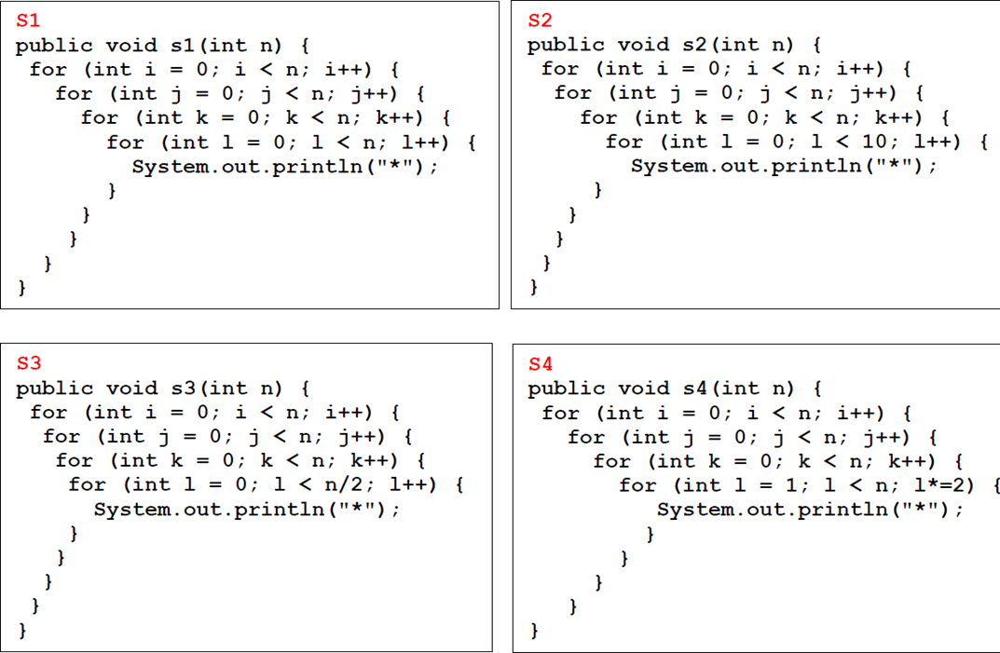

# Big O Notation

Determine the complexity of the following pieces of code.

1\.     Consider the following piece of code. Assume that the “_sequence of statements_” in the FOR loop have a constant complexity - O(1)

&#x20;

<pre class="language-java"><code class="lang-java">for (i = 0; i &#x3C; N; i++) {
    //sequence of statements
}
for (j = 0; j &#x3C; M; j++) {
<strong>    //sequence of statements
</strong>}

</code></pre>


O(n)


How would the complexity change if the second loop went to N instead of M?


It would be O(n)


2\.     Consider the following piece of code. Assume that the “_sequence of statements_” in the FOR loop have a constant complexity - O(1)

```java
for (i = 0; i < N; i++) {
    for (j = 0; j < N; j++) {
        //sequence of statements
    }
}
```


_O(n^2)_


```java
for (k = 0; k < N; k++) { 
    //sequence of statements
}
```


O(n)


3. The following pseudo-code provides the algorithm for looking-up for a key in an array. What is the worse-case complexity?

<pre class="language-python"><code class="lang-python">for i= 1 to n
<strong>    if (array[i] = key)
</strong>        return true
    else
        return false
</code></pre>


_O(n)_


4\.     For each of the following loops with a method call, determine the overall complexity. Assume that method _f_ takes constant time, and that method _g_ takes linear time in the value of its parameter.

```java
for (j = 0; j < N; j++) { 
    f(j);
}
```


_O(n)_


```python
for (j = 0; j < N; j++)
    g(j);	
#(linear time)O(N)	
```


```
if g is a method the O(n^2)
```


5. Below is the code for an algorithm to solve the problem of finding the smallest element from an ArrayList.

```java
public int findSmallElement(ArrayList<Integer> num) { 
    int smElement;
    smElement= num.get(0); 
    for(int i=0; i<num.size() ; i++)
        if(num.get(i) < smElement) smElement=num.get(i);
            return smElement;
}
```

Based on the provided code above, compute the worse-case complexity (Big O) of _findSmallElement_ algorithm. Plot on a graph the growth rate according to the computed Big O function.


O(n)


6. What is the Big O for the following?

<figure><figcaption></figcaption></figure>


S1: O(n^4)

S2: O(n^3)

S3: O(n^4)

S4: O(n^3 \* log n)&#x20;

S4 is logarithmic behavior, with the loop iterating approximately 'log n' times.



